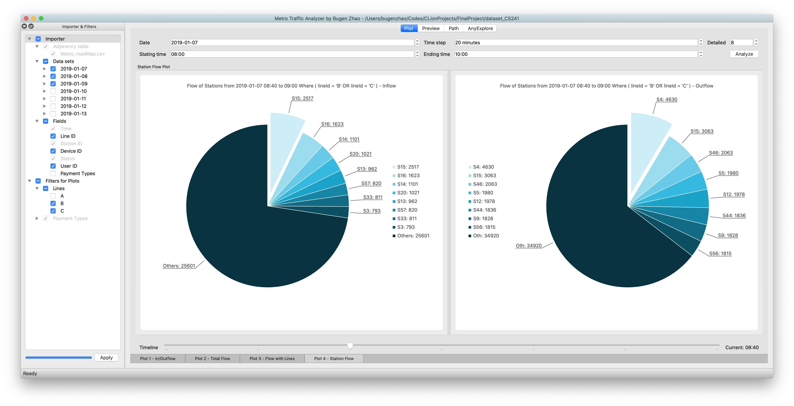

# CS241 Final Project - Metro Traffic Analyzer

## Overview

Metro traffic analyzer is an all-in-one simple GUI data analysis tool based on Qt.

## Introductions

### 1. Filtered Import and Analysis

In the **Importers & Filters** on the left, **Metro Traffic Analyzer** categorizes the raw data sets by date, allowing the user to select the raw data to import, file by file. The user can choose whether to import optional fields such as User ID. Also, users can use Filters for lines and payment types to analyze only the data they are interested in.

**Importers & Filters** is **reusable**, users can add or remove any data at any time without restarting the application. Also, the widget can be moved, closed and reopened whenever you want.

### 2. High-performance, Pretty and Multi-tabbed Plots

Through **Add Tab...** actions via **File** menu or keyboard shortcuts **⌘1~4** , there are **4 different types of plots** available to the user. The user can open **unlimited plots** or even perform analysis at the same time, toggle different tabs freely at the tab bar in the bottom of the user interface.

When the animations are on, the analysis results will be dynamically appended to the plots over time, which brings the plot a **nice look and feel**. With animations off, most plots can be analyzed in **less than 0.5 seconds**, even though 16 million records have been imported.

Introducing the **"Flow of Stations" plot**. The plot provides the user with a **timeline** that allows the user to slide the timeline to analyze inflows and outflows of all stations at different times.

### 3. Route Planning and Time Estimation

In the Path section, **Metro Traffic Analyzer** can plan an optimal travel route, quickly **estimate the times** based on imported data, and list hundreds of travel time records for users' reference.

### 4. AnyExplore

**AnyExplore** supports any standard SQL statements to explore the entire database. It provides the user with **unlimited possibilities** to inspect the data sets in all ways. **Metro Traffic Analyzer** also presets several examples to help the user get started with **AnyExplore**.

### 5. Preferences

The Preferences panel allows users to customize subdirectories where the adjacency tables and data sets are placed. It also provides a slider for users to adjust the analysis speed (animations and sleep time).

## Details

1. **Metro Traffic Analyzer** is based on an in-memory SQLite database. It provides multi-dimensional data analysis and high performance at the same time. After continuous logic optimization and application of multi-core optimization techniques, importing operations perform almost as well as a simple time-based hash table, while **ALL OF THE ANALYSIS** gain much better performance than the latter. (See also: **Discussions => Performance**)

2. Most of the widgets are implemented in separate modules, which is **loosely coupled** with the main window, resulting in clearer code logic, strong reusability and performance improvement.

3. Make full use of multi-threading and Qt signal-slot technique to **avoid time-consuming operation** in the GUI thread and ensure the program GUI's fluency and stability.

4. Easy operation logic and attention to details, such as: 
  
  - Provides user manual to guide users to get started easily.

	- Adopts Layout comprehensively, scaling the window arbitrarily is allowed.
	- Toggles the enabled state of buttons and actions at proper time, bringing to strong robustness. 
	- Indicates current information and operation status through the status bar and title bar.
	- Keyboard shortcuts are supported on any platforms, which is in line with the user's usual operation logic. 

## Results and Discussions

### Performance

| Operation                                     | Time             |
| --------------------------------------------- | ---------------- |
| Import all data sets                          | 84.265 s         |
| Import all data sets without User ID          | 79.143 s         |
| Import data of one day                        | 10.962 s         |
| Plot 1 - Inflow and Outflow                   | 0.291 s          |
| Plot 2 - Total Flow                           | 0.534 s          |
| Plot 3 - Inflow with Lines                    | 0.491 s          |
| Plot 4 - Station Flow                         | 0.163 s - 0.660s |
| Time estimation (235 records)                 | 1.166 s          |
| Select 2.25 million records in **AnyExplore** | 2.120 s          |

With all data imported, **Metro Traffic Analyzer** will takes up about 3.5GB of memory.

All of the results above were tested on a MacBook Pro with 2.3 GHz Eight-Core Core i9 CPU and 32 GB 2667 MHz DDR4 Memory, with "Fastest Analysis Speed" set in Preferences panel.

See also: **Details (1)**

### Results

1. The metro flow is highly correlated with the date. During weekdays, traffic peaks at 8:30 AM and 5:30 PM. There are small peaks at 8:00, 9:00 and 10:00 PM, especially on line B, which may be caused by overtime work. On weekends, there is no significant peak in the flow curve, which maximizes at 5:30 PM.

2. Among the three lines, line B is the busiest, followed by line C, while line A has less traffic. On weekdays, there is little difference between traffic flow of line B and C, but there is twice difference on weekends. Thus, line B may contain more shopping malls, tourist attractions and other service locations.

3. The busiest stations are Station 15, 9, 4, 7 and so on. In particular, Station 15 has the highest inflow and outflow most of the time. Considering that there are only three lines in the Hangzhou metro system, it can be inferred that the Station 15 is a railway station or a transfer station, while the other busy stations are downtown or around the West Lake. Most likely they are all on line B.

## Acknowledgment

- Thanks to Dr. Ling and Dr. Jin for their careful teaching.
- Thanks to TAs for their kind guidance.
- Thanks to my classmate Wei and others for their ideas and inspiration.